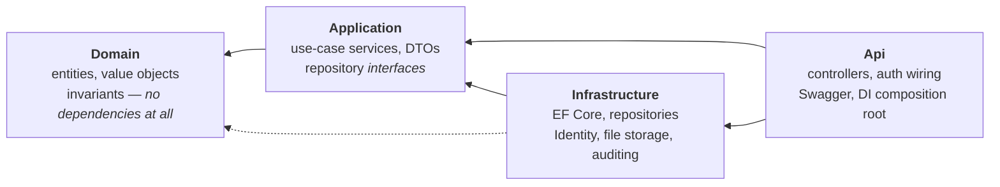
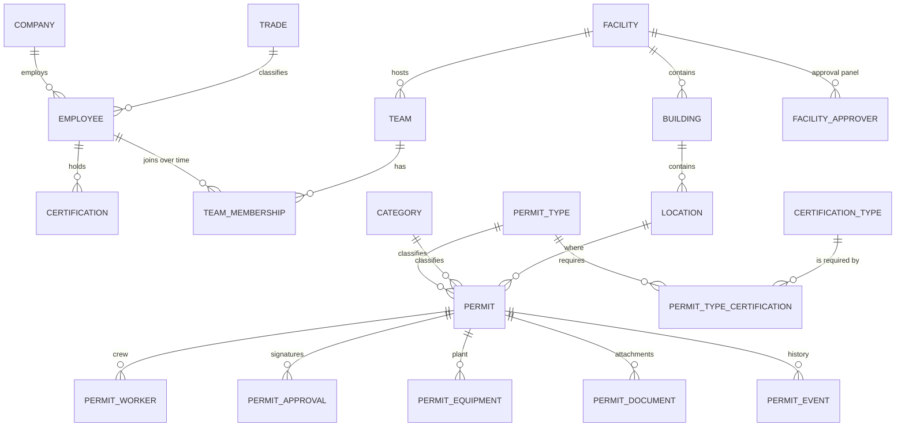
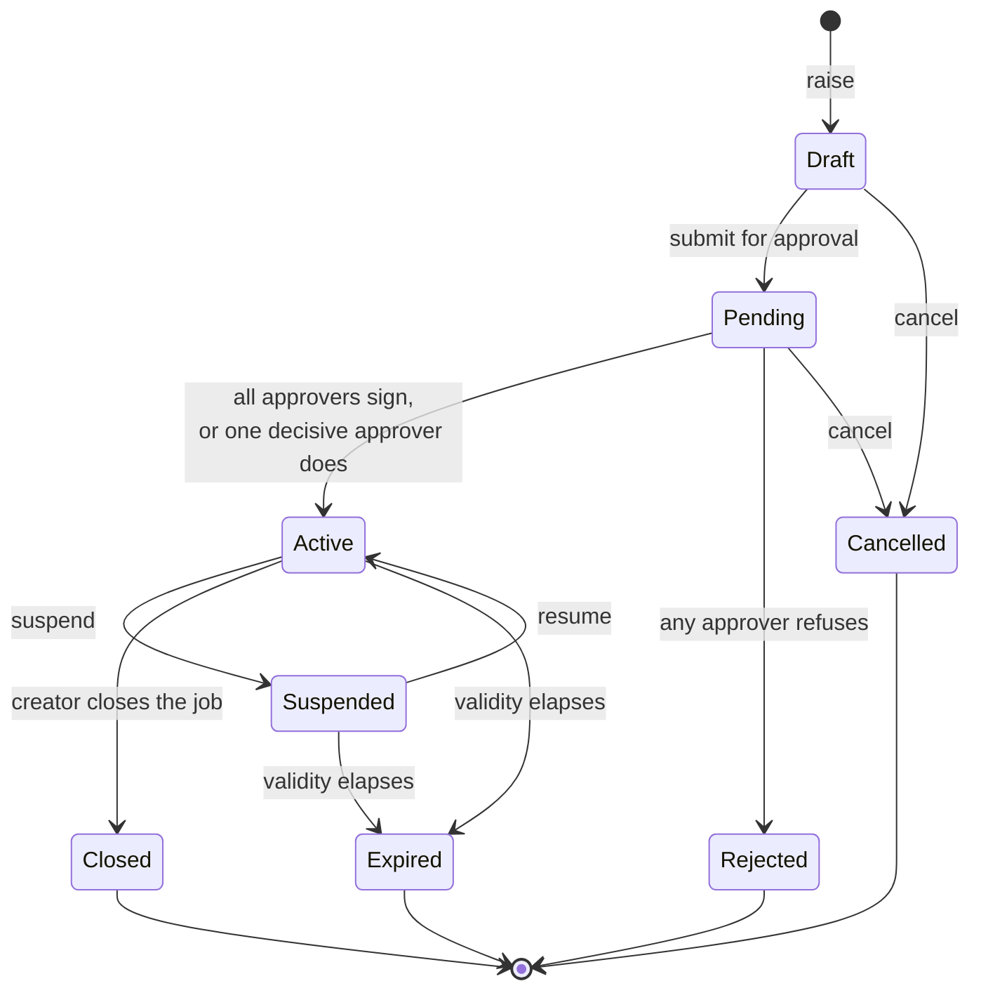

# Permit To Work

A web application for issuing and controlling **permits to work** on an industrial site — the
paper form that says *who* may do *what dangerous job*, *where*, *when*, and *who signed for it*.

Employees are registered, given a trade and certifications, and placed on teams. A permit is
raised against a location, a crew is attached to it, and it travels through an approval panel
before any work may start. The rules that make it safe — a welder without a valid Hot Work
certificate cannot be added to a Hot Work permit — live in the domain model, not in the UI.

<p>
  
  
  
  
  
</p>

> Final project — **Coding Factory 10**, Athens University of Economics and Business.

---

## Contents

- [Quick start](#quick-start)
- [What it does](#what-it-does)
- [Architecture](#architecture)
- [The domain model](#the-domain-model)
- [The permit lifecycle](#the-permit-lifecycle)
- [Security model](#security-model)
- [Running the tests](#running-the-tests)
- [API reference](#api-reference)
- [Project layout](#project-layout)
- [Design notes](#design-notes)
- [Scope and limitations](#scope-and-limitations)

---

## Quick start

### Prerequisites

| Tool | Version | Why |
|---|---|---|
| [.NET SDK](https://dotnet.microsoft.com/download) | 10.0 or later | API and tests |
| [Node.js](https://nodejs.org) | 24.15 or later | Angular 22 requires it |
| [Docker Desktop](https://www.docker.com/products/docker-desktop/) | any current | runs SQL Server |

No local SQL Server installation is needed — the database runs in a container.

### 1. Start the database

```bash
docker compose up -d sqlserver
```

SQL Server 2022 comes up on `localhost:1433` with a named volume, so data survives a restart.
The compose file defines a healthcheck; give it about thirty seconds on a cold start.

### 2. Create the schema

The database is generated from the model — six EF Core migrations, `InitialSchema` through
`AuditLog`. Apply them once:

```bash
dotnet ef database update -p src/PermitToWork.Infrastructure -s src/PermitToWork.Api
```

> If `dotnet ef` is not installed: `dotnet tool install --global dotnet-ef`

### 3. Run the API

```bash
dotnet run --project src/PermitToWork.Api
```

In development the API **seeds itself** on start: reference data, a facility with buildings and
locations, five permit types, and one administrator account. Seeding is idempotent — every step
checks before it writes — so it is safe on every run.

Swagger UI is at **<https://localhost:7188/swagger>** (the root redirects there).

### 4. Run the client

```bash
cd client
npm install
npm start
```

The application opens at **<http://localhost:4200>**. The dev server proxies `/api` to
`https://localhost:7188`, so there is nothing to configure.

### 5. Sign in

| Email | Password | Role |
|---|---|---|
| `admin@permittowork.local` | `Admin!23456` | Administrator |

Change this before deploying anywhere real — the API logs a warning to that effect on every
seed. The seeded administrator also sits on the approval panel of the seeded facility and is
marked *decisive*, so a fresh installation can raise **and** approve a permit immediately.

### What gets seeded

| | |
|---|---|
| **Companies** | Hellenic Industrial Works (owner), Acme Maintenance Services (contractor) |
| **Site** | Refinery North → Distillation Unit 3 → Level 2 East, Pump House |
| **Trades** | Supervisor, Welder Gr.3, Pipe Fitter, Electrician |
| **Certifications** | Hot Work, Confined Space Entry, Working at Height, Lockout/Tagout, First Aid |
| **Permit types** | Hot Work, Confined Space Entry, Working at Height, Electrical, Cold Work |
| **Categories** | Maintenance, Inspection, Construction, Cleaning |

Cold Work deliberately requires no certification — so there is a permit type that demonstrates
the certification rule *not* firing, as well as four that demonstrate it firing.

### Configuration

Everything needed for local development is committed in `appsettings.Development.json`,
including a development-only JWT signing key. Anywhere real, the key comes from user secrets or
an environment variable, and **the application refuses to start without one**:

```bash
dotnet user-secrets init -p src/PermitToWork.Api
dotnet user-secrets set "Jwt:SigningKey" "<a long random string>" -p src/PermitToWork.Api
```

| Setting | Default | Meaning |
|---|---|---|
| `ConnectionStrings:PermitToWorkDb` | `localhost,1433` | matches `docker-compose.yml` |
| `Jwt:AccessTokenLifetimeMinutes` | `60` | token lifetime |
| `Storage:DocumentRoot` | `uploads` | where attachments are written |
| `PermitExpiry:IntervalMinutes` | `15` | how often elapsed permits are swept |
| `Email:SmtpHost` | *empty* | empty writes `.eml` files to `Email:Outbox` instead of sending |
| `Email:ApplicationUrl` | `http://localhost:4200` | the address in the link a new hire receives |

**Email without a mail server.** Creating an employee sends them an invitation to register.
With no `Email:SmtpHost` configured — the default — each message is written to the `outbox`
folder beside the API binary as a real `.eml` file you can open in any mail client. Set
`Email:SmtpHost`, `Email:SmtpUser` and (through user secrets) `Email:SmtpPassword` to send
for real. Delivery failures are logged and never abort the action that triggered them.

---

## What it does

**Employees.** Create a person, give them a company, a trade, a job title and a manager. Their
badge number is generated (`ACME-0001`) and cannot be typed by hand. Certifications are recorded
with an issue and expiry date; whether one is *valid* is computed from the expiry date and never
stored. Age is computed from the date of birth for the same reason.

**Teams.** A team belongs to a facility, is created with a leader, and has a generated code
(`MEC-2026-0001`). Memberships are *ended*, never deleted — the first question an incident
investigation asks is who was on the crew that day.

**Permits.** A permit is raised as a draft against a permit type, a category, a location and a
date range. Workers and equipment are attached, documents may be uploaded, and it is then
submitted to the facility's approval panel. Approvals, rejections, suspensions and closure are
all recorded as events on the permit, so its history is readable end to end.

**Administration.** Reference data (companies, sites, trades, certification types, categories,
permit types) is maintained through the UI. A full audit trail of every insert, update and
delete is available to administrators only.

---

## Architecture

Four projects, with dependencies pointing **inwards only**.



The rule that makes the layering real rather than decorative: **repository interfaces live in
`Application/Abstractions/`, implementations in `Infrastructure/Persistence/Repositories/`.**
Application never references Infrastructure. A controller never touches a `DbContext`.

`Domain` has no package references whatsoever — not EF Core, not ASP.NET. It is plain C#, which
is why the domain tests run without a database, a mock, or a container.

---

## The domain model



`Permit` is an aggregate root: workers, approvals, equipment, documents and events are reachable
only through it, and every rule that involves more than one of them is enforced by a method on
`Permit` rather than by a service reaching in from outside.

Value objects — `EmployeeNumber`, `PersonName`, `ContactInfo`, `Address`, `DateTimeRange`,
`PermitNumber` — replace loose primitives. A `DateTimeRange` cannot be constructed with its end
before its start, which removes an entire class of bug rather than validating for it.

The full model and the decisions behind it are written up in
[`docs/01-domain-and-scope.md`](docs/01-domain-and-scope.md) and
[`docs/02-permits.md`](docs/02-permits.md).

---

## The permit lifecycle



Three roles are assigned **per permit** — they are not application roles:

- **Creator** — raised it, and is the one who may close it when the job is done.
- **Receiver** — responsible for the work actually being carried out on site.
- **Issuer** — derived, not stored: the last approver who signed it into `Active`.

Two rules worth pointing out, because both are tested directly against the aggregate:

**Certifications are checked at both ends of the window.** Adding a worker to a Hot Work permit
verifies their Hot Work certificate is valid on the start date *and* the end date. A certificate
expiring mid-permit is refused, because the job would outlive it.

**Elapsed permits expire on their own.** A background sweep (`PermitExpiryWorker`) runs every
fifteen minutes and asks each permit whether its validity has passed. Without it, `ExpireIfElapsed`
would be tested-but-unreachable code, and a permit would sit `Active` forever.

---

## Security model

**Authentication** is ASP.NET Core Identity for the credential store plus JWT bearer tokens.
Registration does not create a person — an administrator enters the employee record first, and
registration claims it by email. Nobody invents their own identity.

**Authorization** is driven by `Employee.AccessRole`, a single field on the employee record. The
token's `role` claim is issued from that value and nothing else, so "what is Maria allowed to do"
has exactly one home.

| Role | May do |
|---|---|
| **Employee** | read-only — the default for everyone until someone decides otherwise |
| **Responsible** | create and modify teams, manage membership |
| **Supervisor** | manage employee records, assign access roles |
| **SafetyOfficer** | record and revoke certifications; sees every company |
| **Administrator** | everything, including reference data and the audit log |

**Company scoping is not optional.** A contractor may only see their own company's data. This is
enforced by an **EF Core global query filter** driven by `ICurrentUser` — not by `if` statements
scattered through controllers, which is the version that eventually misses one.

**Auditing.** An EF Core `SaveChangesInterceptor` records every insert, update and delete with the
acting user, the entity, the changed values and a timestamp. The trail deliberately crosses every
company boundary the rest of the application enforces, which is precisely why
`GET /api/audit` is **restricted to administrators** and the screen is hidden from everyone else.

---

## Running the tests

```bash
docker compose up -d sqlserver          # required for the integration tests
dotnet test PermitToWork.sln
```

**179 tests: 158 unit + 21 integration.**

| Layer | What it proves | Needs a database? |
|---|---|---|
| **Domain** | permit transitions, certification expiry, value object invariants | no |
| **Application** | service behaviour, with test doubles only at real boundaries | no |
| **Integration** | the real API in memory — routing, JWT, authorization filters, exception handler, query filters, audit interceptor | yes |

The integration tests run against a **real SQL Server database of their own**
(`PermitToWork_IntegrationTests`), dropped and rebuilt per run, created by applying the migrations
— which also proves the migrations produce a schema the application can actually run against.

They use real SQL Server on purpose: `CounterStore` hands out badge and permit numbers with a
T-SQL `MERGE`, which no in-memory provider can execute. Substituting the database would mean the
tests exercise a different application from the one that ships.

**Without Docker running, they skip rather than fail**, with one legible line:

```
SQL Server is not reachable. Start it with: docker compose up -d sqlserver
```

Filter to a subset:

```bash
dotnet test --filter "FullyQualifiedName~PermitLifecycleTests"
dotnet test --filter "FullyQualifiedName~Integration"
```

### Frontend tests

```bash
cd client && npm test
```

Vitest, no browser. The suite covers the pieces where a mistake is invisible: the JWT claim
chain in `AuthService`, the route guards, the HTTP interceptor's 401-versus-403 distinction,
the mapping from RFC 7807 to a sentence, and the employee detail screen end to end against a
fake backend.

### Postman

Two collections under [`postman/`](postman/), covering the employee and team endpoints and the
full permit flow, with test scripts that assert status codes and chain ids between requests.
Import both, run the login request first — it stores the token in a collection variable — then
run the folders in order. See [`postman/README.md`](postman/README.md).

---

## API reference

Swagger UI at `/swagger` documents every endpoint, with the schemas and a working
**Authorize** button. The outline:

| Area | Endpoints |
|---|---|
| **Auth** | `POST /api/auth/register`, `POST /api/auth/login`, `GET /api/auth/me` |
| **Employees** | list, get, create, update, access role, manager, suspend / reinstate / terminate, certifications |
| **Teams** | list, get, create, update, members, member role, disband, `GET /api/employees/{id}/teams` |
| **Permits** | list, get, create, update, workers, equipment, documents, `submit`, `approve`, `reject`, `suspend`, `resume`, `close`, `cancel` |
| **Approval panels** | `GET/POST /api/facilities/{id}/approvers`, set decisive, remove |
| **Lookups** | companies, trades, certification types, facilities, buildings, locations, permit types, categories |
| **Administration** | `/api/admin/*` reference data, `/api/audit` audit trail |
| **Health** | `GET /api/health` — open, no token needed |

Errors are RFC 7807 problem details throughout, mapped by a single exception handler:
**404** not found, **409** conflict, **422** a domain rule refused, **500** everything else.
A domain rule's own sentence reaches the client intact — the UI never invents its own wording for
a refusal the server made.

---

## Project layout

```
PermitToWork/
├── src/
│   ├── PermitToWork.Domain/          entities, value objects, invariants — no dependencies
│   ├── PermitToWork.Application/     services, DTOs, repository interfaces
│   ├── PermitToWork.Infrastructure/  EF Core, repositories, Identity, storage, auditing
│   │   └── Migrations/               six migrations, InitialSchema → AuditLog
│   └── PermitToWork.Api/             controllers, auth wiring, Swagger, background worker
├── tests/
│   └── PermitToWork.Tests/           Domain/ Application/ Integration/
├── client/                           Angular 22 — standalone, signals, zoneless
│   └── src/app/
│       ├── core/                     auth, guards, typed API clients, settings
│       └── features/                 login, employees, teams, permits, approvals, admin, settings
├── docs/                             domain and permit design decisions
├── postman/                          two collections + how to run them
├── docker-compose.yml                SQL Server 2022
├── Directory.Packages.props          central package management — versions live only here
└── PermitToWork.sln
```

The Angular client is standalone-component, signal-based and zoneless, with a light/dark theme
and a settings screen. Routes are guarded twice: an auth guard for the token, and a role guard on
the administration screens.

---

## Design notes

A few decisions that are easy to miss from the outside.

**Derived values are never stored.** Age comes from the date of birth. Whether a certification is
valid comes from its expiry date. Who issued a permit comes from its approvals. Anything stored
is a second copy that can disagree with the first.

**Generated numbers are atomic.** Badge, team and permit numbers come from a counters table
updated with a T-SQL `MERGE … WITH (HOLDLOCK) … OUTPUT`. The obvious `MAX() + 1` has a race window
that two concurrent registrations would eventually find.

**Snapshots preserve history.** A permit copies the certification requirements and the approval
panel onto itself when it is raised and submitted. Changing a permit type's requirements next
month must not rewrite what last month's permit was approved against.

**Booleans lose their meaning.** `EmploymentStatus` is an enum, not `IsActive`. A permit's
validity is a `DateTimeRange`, not two loose `DateTime`s that can be ordered wrongly.
`PermitStatus` changes only through transition methods on the aggregate.

**Uploads validate before they write.** Documents are stored under generated keys, never the
browser's filename; the path is checked for escape sequences; the size and content type are
validated before any bytes are written, and the bytes are removed if the row fails to save. The
limits shown in the UI (10 MB; PDF, Word, images) are served by the API, so the hint cannot
contradict the server.

---

## Scope and limitations

Stated plainly, because a project that claims to do everything is the less honest one.

**Deliberately out of scope**

- Refresh tokens — access tokens are short-lived and re-issued by logging in again.
- Email or push notifications when a permit needs a signature.
- The chemicals and PPE tabs from the original paper form.
- Isolation certificates and gas testing, which are separate documents in a real plant.

**Known gaps**

- The Angular tests cover the core (auth, guards, the interceptor, error mapping) and one
  screen. The remaining components are exercised by hand rather than by a test.

---

## Licence

Coursework, submitted for assessment. Not licensed for production use — and please change that
seeded password first.
